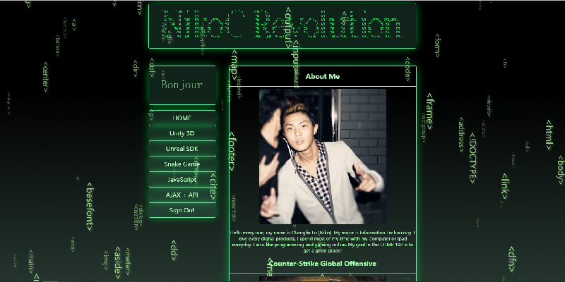

# 联系方式

- 本简历电子版: https://github.com/nikoc2016/resume
- 手机：18576216223, +1 (408) 656 1558
- Email：chenglin.lu217@myci.csuci.edu, nikoc2016@163.com
- 微信号：nikoc_lin

---

# 个人信息

 - 陆澄霖/男/1996
 - 本科/加州州立大学CI分校 IT专业
 - Github：https://github.com/nikoc2016


---

# 个人特色

### 电子竞技
我于2008年成为一名游戏玩家，玩过上百款游戏并有上万小时的游戏时间。最喜欢的电竞类型是FPS(第一人称射击类)，Wargame(战争策略游戏)，Simracing(模拟赛车)。这些游戏培养了我出色的洞察能力，分析能力，快速策略制定能力，对战心理素质以及反应速度。
### 学习能力
我的学习策略非常注重效率。在学习新东西时，我能快速理解新架构，并以极快的速度发现BUG并给出修复方案。策略制定能力让我在小组项目中多次成为组长和领头人，因为我常最快的给出高效率的解决方案。

---

# 学习经历

## 美国加州州立大学 CSU Channel Islands (2017-2018)
---
### Food Indicator 项目
##### 小队人数:2人
这是一个基于Django的webapp, 通过twitter API 来分析统计每个州最受欢迎的食物。我负责了前端和后台开发。开发此项目之前，我只用过python做一个小型p2p聊天软件。学习和使用python的库成为了我最大的困难，因为有C++，Java的基础，我在一个月内完成了前后端的开发。
<div align="center">
 <br>
 <a href="http://student.csuci.edu/~chenglin.lu217/WebIntel/prototype/" align="center">点此打开前端预览版</a>
</div>
<br>
关键词: django, python, html, css, js

---
### PocketLogic 项目
##### 小队人数:4人
这是一个基于安卓平台的手机游戏，通过放置逻辑门(AND,OR,XOR..)来输出一个指定的结果以完成游戏。我负责游戏逻辑设计和画面渲染两个部分。在此之前我从未接触过手机软件开发，需要从零开始学习安卓开发。该项目遵从Agile Style, 目前正在开发。
<div align="center">
 <br>
</div>
<br>

关键词: android, java, canvas

---
## HTML5作品
---
### 个人主页
从入门到制作出该个人主页，我花了三个月的时间上课和自学。主页里有canvas编程动画，贪吃蛇小游戏，以及发光的CSS。
<div align="center">
 
</div>

### U-Ride 拼车软件
上E-Commerce(网络贸易)课时要求做一个项目原型，我设计了一款手机拼车APP。
<div align="center">
 
</div>

### 游戏登录器
为 [酷派天空](https://www.kupai.me/) 旗下的GTA5私服开发的游戏内登录器。
<div align="center">
 
</div>

<br>
关键词: html5, css, javascript, jquery, bootstrap

---
## 加州圣何塞 De Anza 大学 (2014-2016)

### Prison Database
##### 小队人数:2人
因为钟爱于监狱模拟类游戏，我带领着5人小队开发了一个基于C++的囚犯索引程序。该C++程序作为监狱模拟游戏的内核，通过开发Hash table, Linklist 数据结构和使用优化算法来实现一个可以快速储存和索引囚犯数据的架构。

初提出该方案的时候，导师认为我不可能在一个月内竣工并极力反对，我说服导师后并召集了队友并组成了五人小队。

设计架构和安排分工成为了我初期的最大困难，后期作为队内编程能力较强的人，我负责快速阅读队员写好的代码并且找出漏洞然后提供解决方案。由于我的Debug时间平均只占队友Debug时间的10%，我们小队最终在一个月内高效完成了项目并在学期结束时获得了CS部门的称赞。
[源码](https://github.com/nikoc2016/prisionBreakEngine)

---
### 其他项目
####Android\安卓:
三子棋小游戏
三门问题小游戏
街头生存模拟[开发中]
...
####Java\C#:
Unity小游戏
MD5生成器
Adobe Animate
...

---
# 项目和作品链接

*部分链接需要Google支持，大陆地区无法正常访问
*网页如果渲染不正常，请使用电脑Chrome浏览器打开

- [U-Ride 拼车App](https://nikoc2016.github.io/U-Ride%20Online/)：一个HTML5 Webapp. (需要VPN)
- [个人主页](https://nikoc2016.github.io/Project3/index.html)：一个HTML5主页，里面包含JS开发的矩阵雨特效和贪吃蛇游戏(需要Chrome).
- [游戏内登录窗口](https://nikoc2016.github.io/LoginPanel/login.html)：一个GTA5私服游戏内登录器
- [Django Webapp](https://github.com/nikoc2016/foodApp-2017)：一个Python Webapp进行数据分析和预测
- [Unity 小游戏](https://github.com/nikoc2016/foodApp-2017)：感恩节开发的一个控制小飞碟的Unity小游戏
- [helloPHP](https://github.com/nikoc2016/PHPchatroom)：一个PHP的小聊天室
- [Django Webapp](https://github.com/nikoc2016/foodApp-2017)：一个Python网络应用分析Twitter关键词进行数据处理。
- [Monty Hall](https://github.com/nikoc2016/MontyHall)：一个安卓小游戏，三门问题。
- [Tripple C](https://github.com/nikoc2016/Tripple-C)：一个安卓三子棋带AI游戏。
- [Prsionbreak C++](https://github.com/nikoc2016/prisionBreakEngine)：C++写的监狱模拟器的囚犯数据存取内核。

---
# 语言
本人能流利听说读写以及翻译以下三门语言
 - 普通话(国语)
 - 广东话(粤语)
 - 美式英文(英语)

---
# 技能关键词

```标有 * 号均为入门水平```
 - c++
 - c#
 - java
 - javascript
 - jquery
 - python*
 - html
 - css*
 - ajax
 - bootstrap*
 - photoshop*
 - linux/unix*
 - mvc*
 - xml
 - android*

---
# 致谢
感谢您花时间阅读我的简历，期待能有机会和您共事。
